# Data Flow Diagrams - React + ASP.NET Architecture

## Overview

This document provides detailed data flow diagrams showing how data moves through the React frontend and ASP.NET Core backend in the Kitji Studios application.

## System Architecture Overview

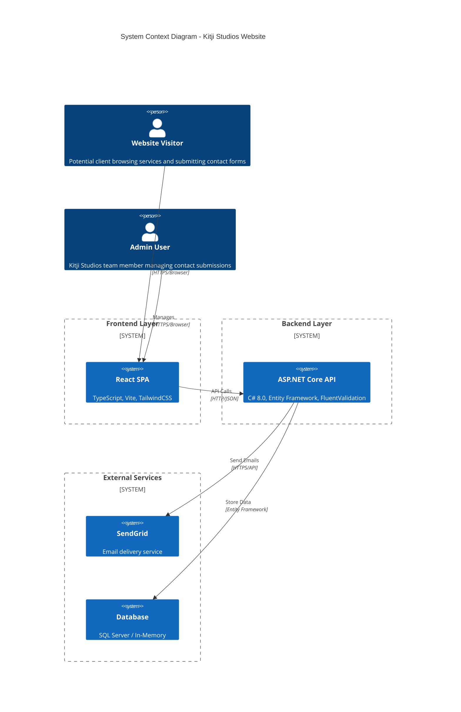

## Contact Form Data Flow

### Complete Form Submission Journey

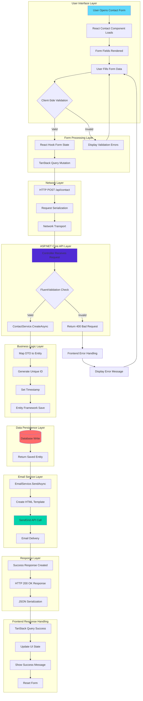

### Data Transformation Flow

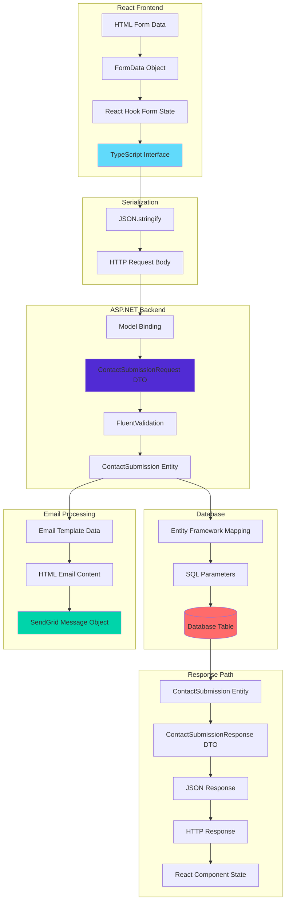

## State Management Flow

### React Component State Flow

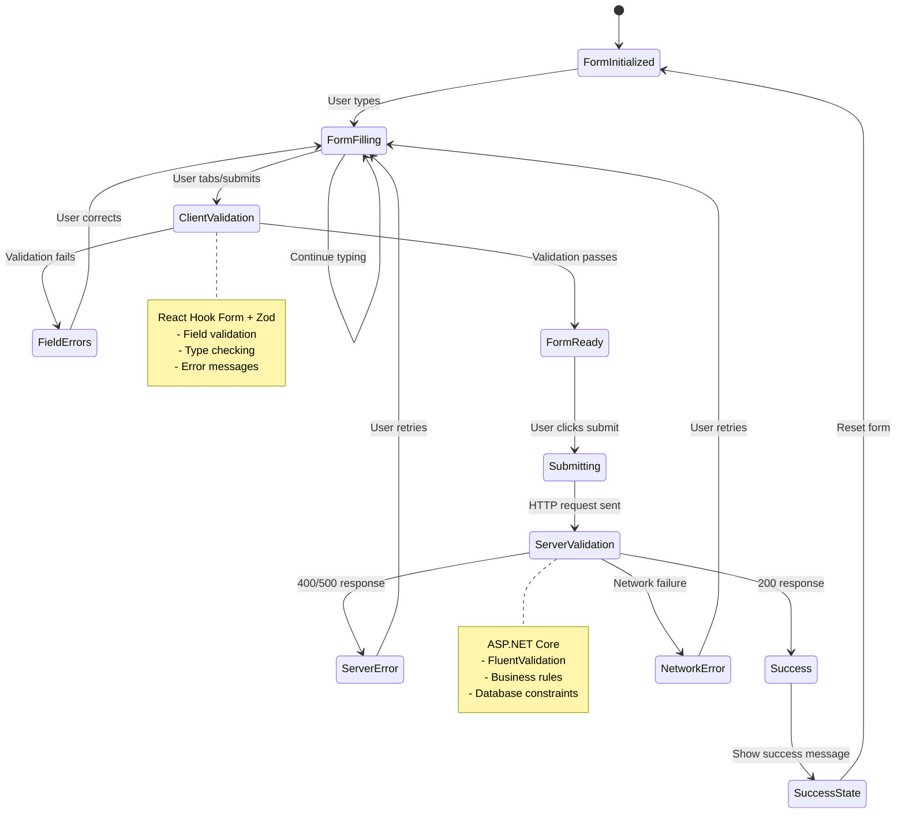

### TanStack Query State Management

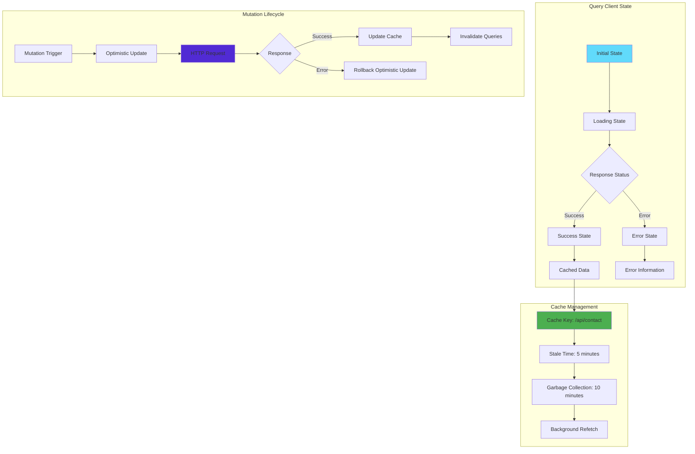

## Error Handling Flow

### Comprehensive Error Handling Strategy

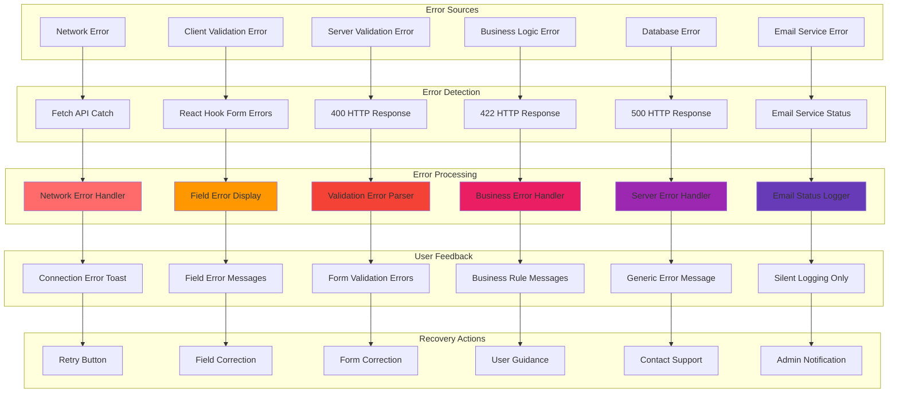

## Authentication & Authorization Flow (Future)

### Planned Admin Authentication

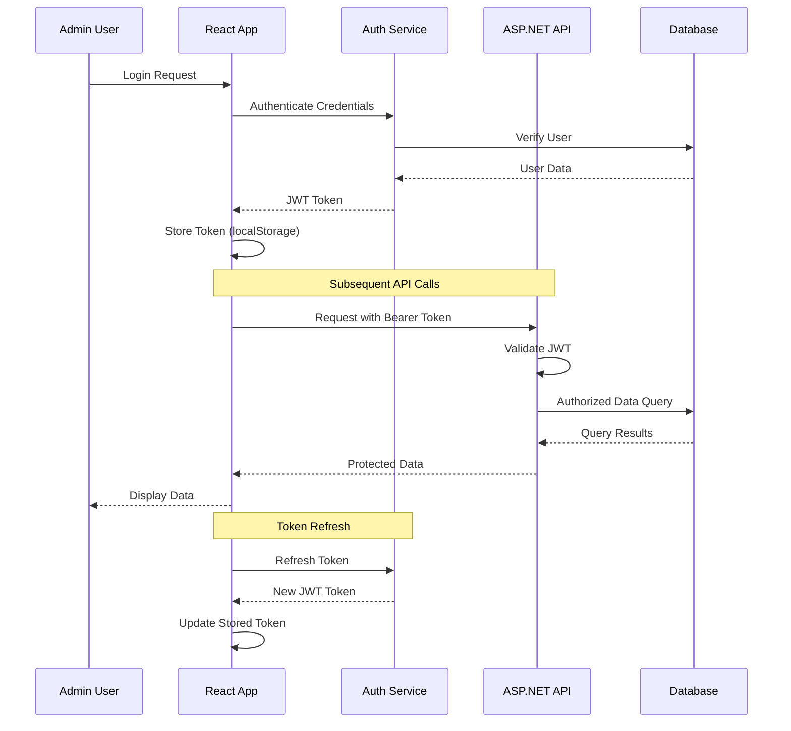

## Performance Optimization Flow

### Caching Strategy

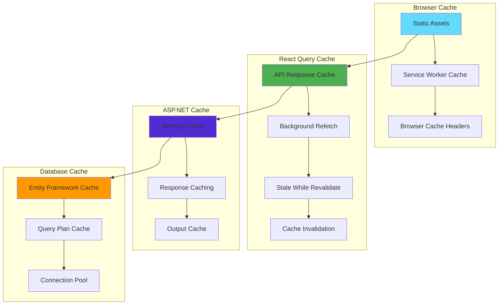

### Bundle Optimization Flow

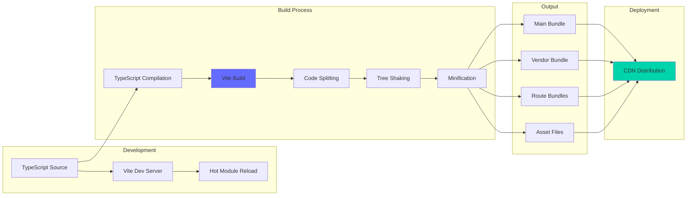

## Database Operation Flow

### Entity Framework Data Flow

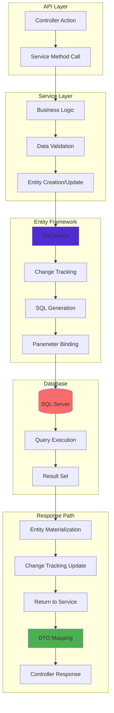

## Real-time Updates Flow (Future Enhancement)

### SignalR Integration Plan

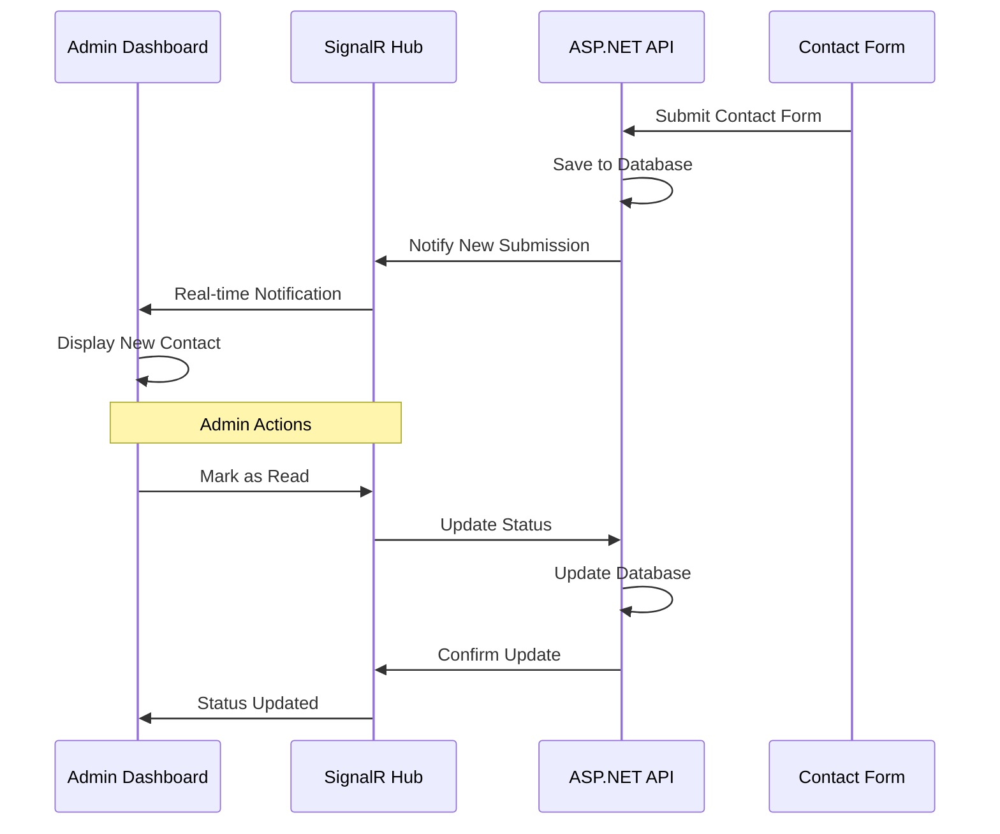

This comprehensive data flow documentation ensures that all stakeholders understand how data moves through the React + ASP.NET Core architecture, from user interaction to database persistence and email delivery.