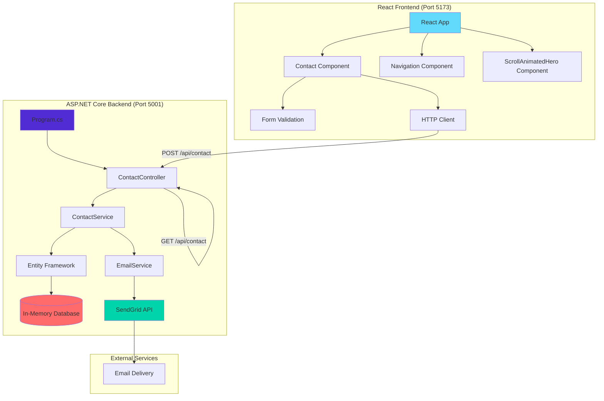
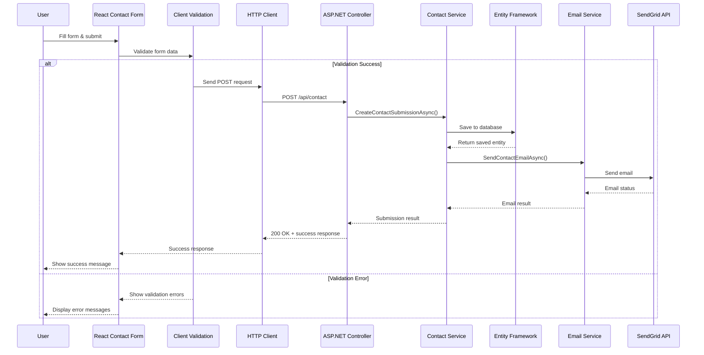
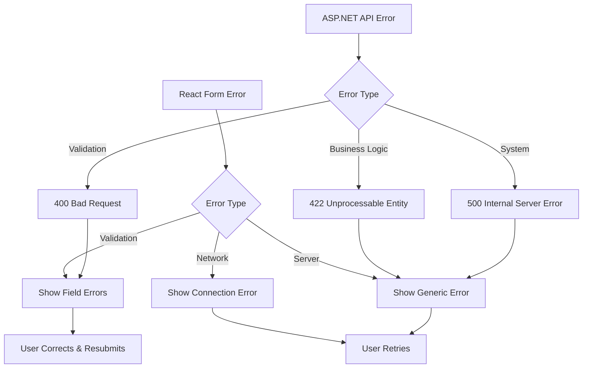

# React + ASP.NET Core Architecture Workflow

## System Overview

This document describes the hybrid architecture where the React TypeScript frontend communicates with an ASP.NET Core backend, replacing the original Express.js server while maintaining all existing functionality.

## Architecture Diagram



## Component Interaction Flow

### 1. Contact Form Submission Flow



### 2. Data Flow Architecture

```mermaid
flowchart LR
    subgraph "Frontend Layer"
        A[React Components] --> B[TypeScript Interfaces]
        B --> C[HTTP Client Service]
    end
    
    subgraph "API Layer"
        D[ASP.NET Controllers] --> E[Request DTOs]
        E --> F[FluentValidation]
    end
    
    subgraph "Business Logic Layer"
        G[Service Interfaces] --> H[Service Implementations]
        H --> I[Domain Models]
    end
    
    subgraph "Data Layer"  
        J[Entity Framework] --> K[DbContext]
        K --> L[Database Entities]
    end
    
    C -->|HTTP Requests| D
    F --> G
    I --> J
    
    style A fill:#61dafb
    style D fill:#512bd4
    style G fill:#4caf50
    style J fill:#ff9800
```



## File Structure Integration

### React Frontend Structure (Unchanged)
```
client/src/
├── components/
│   ├── Contact.tsx              # Form submission to ASP.NET API
│   ├── Navigation.tsx           # Client-side routing
│   └── ScrollAnimatedHero.tsx   # Interactive animations
├── pages/
│   ├── home.tsx                 # Main landing page
│   └── about.tsx                # Company information
├── lib/
│   └── queryClient.ts           # HTTP client configuration
└── hooks/
    └── use-toast.ts             # UI feedback system
```

### ASP.NET Backend Structure (New)
```
Server.NET/
├── Controllers/
│   └── ContactController.cs     # API endpoints for React
├── Services/
│   ├── IContactService.cs       # Business logic interface
│   ├── ContactService.cs        # Contact form processing
│   ├── IEmailService.cs         # Email service interface
│   └── EmailService.cs          # SendGrid integration
├── Models/
│   └── ContactSubmission.cs     # Data models & DTOs
├── Data/
│   └── ApplicationDbContext.cs  # Entity Framework setup
└── Program.cs                   # Application startup
```

## API Integration Points

### 1. Contact Form Endpoint
- **React Side**: `client/src/components/Contact.tsx`
- **ASP.NET Side**: `Server.NET/Controllers/ContactController.cs`
- **Method**: POST `/api/contact`
- **Data Flow**: Form → Validation → HTTP → Controller → Service → Database → Email

### 2. Admin Dashboard (Future)
- **React Side**: New admin components
- **ASP.NET Side**: Admin controller with authentication
- **Method**: GET `/api/contact` (with pagination)

## Configuration Integration

### Development Setup
1. **React Dev Server**: `npm run dev` (Port 5173)
2. **ASP.NET Dev Server**: `dotnet run` (Port 5001)  
3. **CORS Configuration**: Allows React origin
4. **Environment Variables**: Shared `.env` file

### Production Deployment
1. **React Build**: `npm run build` → Static files
2. **ASP.NET Host**: Serves both API and React build
3. **Single Port**: All traffic through ASP.NET (Port 80/443)

## Error Handling Strategy



## Performance Considerations

### React Frontend Optimizations
- **Code Splitting**: Lazy load components
- **Caching**: TanStack Query for API responses
- **Bundle Size**: Tree shaking unused code
- **Image Optimization**: WebP format with fallbacks

### ASP.NET Backend Optimizations
- **Database**: Entity Framework query optimization
- **Caching**: In-memory caching for static data
- **Compression**: Response compression middleware
- **Rate Limiting**: Prevent abuse of contact form

## Testing Strategy

### Frontend Testing
- **Unit Tests**: Component testing with Jest
- **Integration Tests**: API communication testing
- **E2E Tests**: Form submission workflows

### Backend Testing  
- **Unit Tests**: Service layer testing
- **Integration Tests**: Database operations
- **API Tests**: Controller endpoint testing

## Security Implementation

### React Security
- **Input Sanitization**: XSS prevention
- **HTTPS Only**: Secure communication
- **CSRF Protection**: Token validation

### ASP.NET Security
- **Input Validation**: FluentValidation rules
- **CORS Policy**: Restricted origins
- **Rate Limiting**: Request throttling
- **Logging**: Security event monitoring

This hybrid architecture provides the flexibility of React for the frontend while leveraging the robustness and type safety of ASP.NET Core for the backend services.