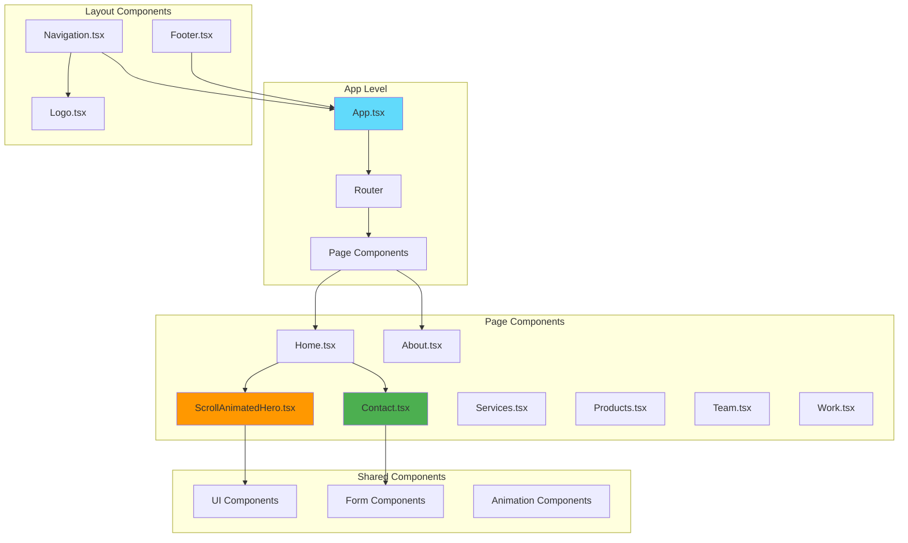
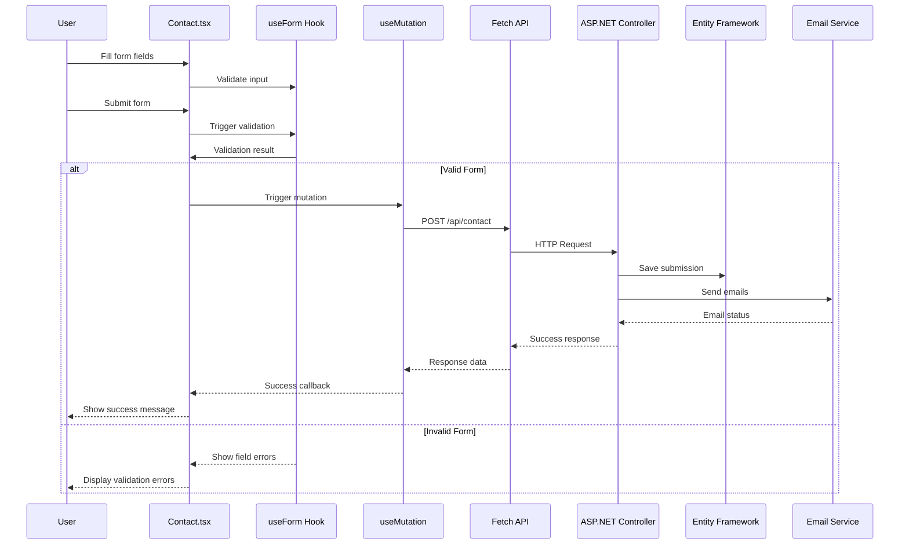
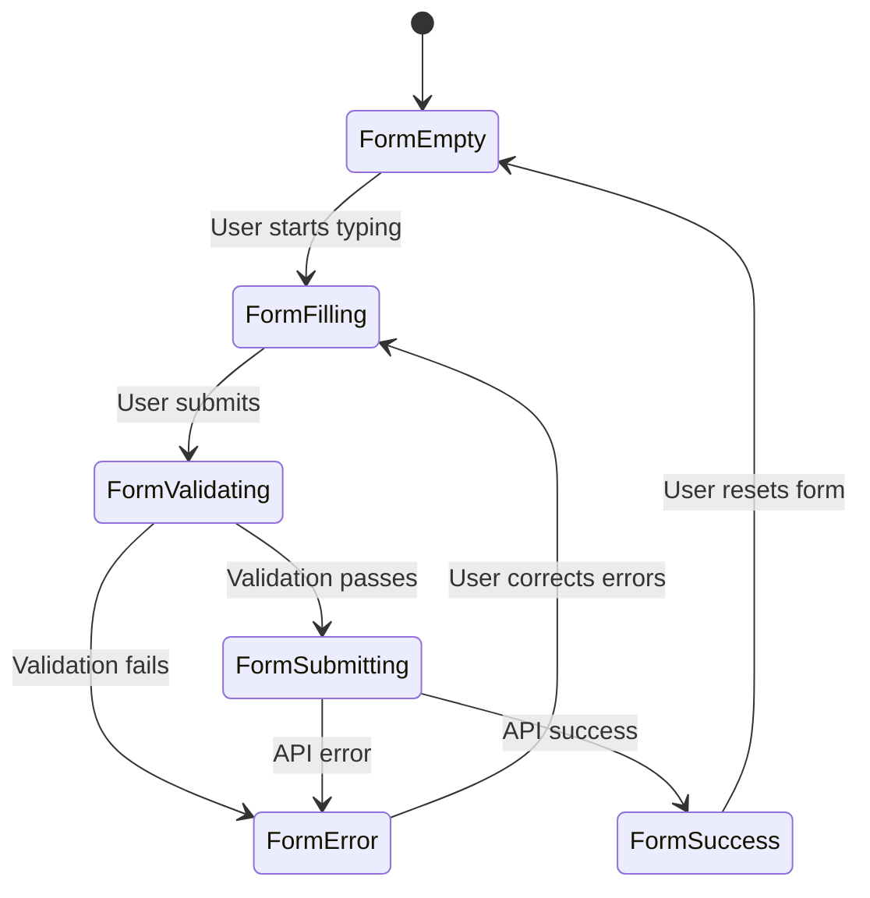
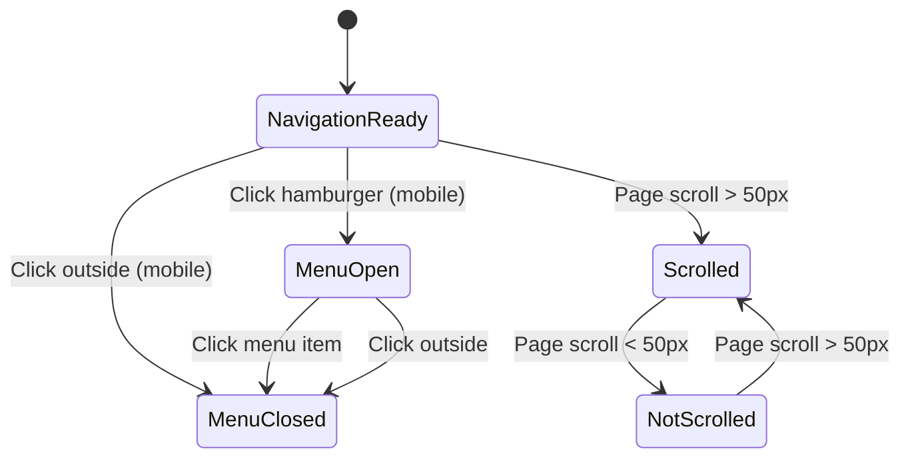
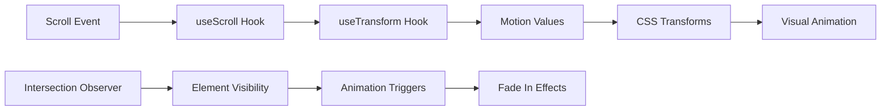
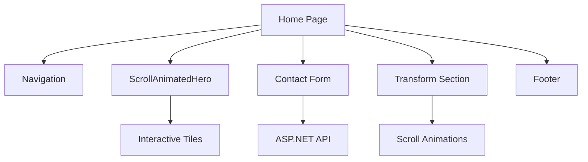
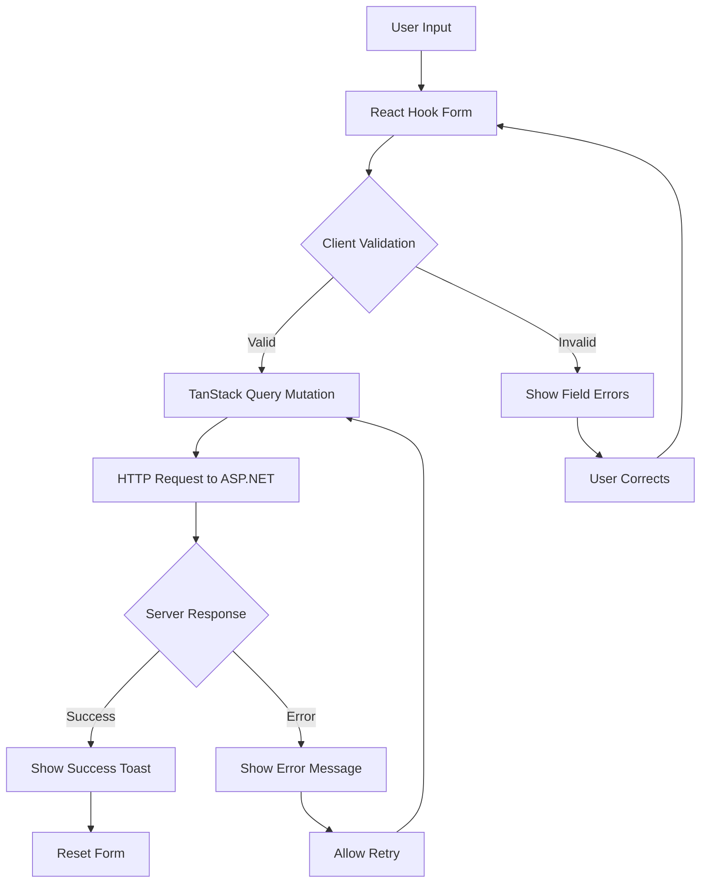
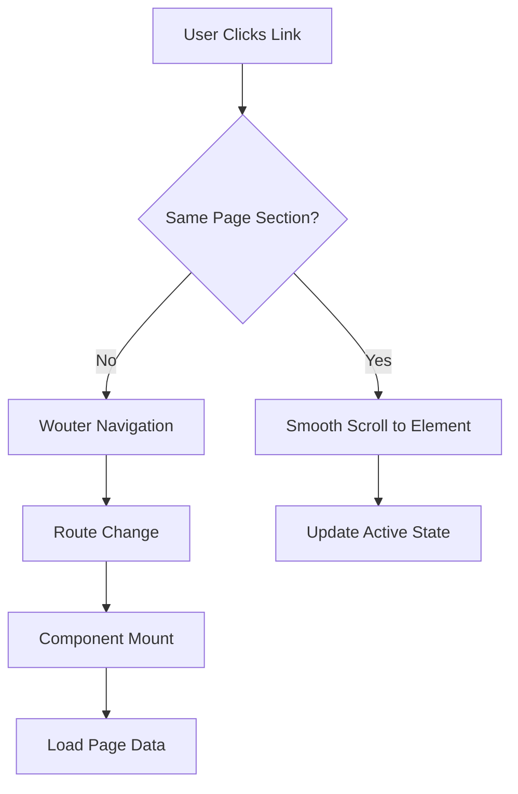

# React Components Documentation

## Overview

This document provides comprehensive documentation for all React components in the Kitji Studios website, including their interaction with the new ASP.NET Core backend.

## Component Architecture



## Component Interaction with ASP.NET Backend

### Contact Form Component Flow



## Core Components

### 1. Contact Component (`client/src/components/Contact.tsx`)

**Purpose**: Handles contact form submissions to ASP.NET Core backend
**Location**: `client/src/components/Contact.tsx`
**Backend Integration**: `POST /api/contact`

#### Component Structure

```typescript
interface ContactFormData {
  name: string;
  email: string;
  company?: string;
  projectType: string;
  budget?: string;
  message: string;
}

export default function Contact() {
  // Form state management with React Hook Form
  const form = useForm<ContactFormData>({
    resolver: zodResolver(contactFormSchema),
    defaultValues: {
      name: "",
      email: "",
      company: "",
      projectType: "",
      budget: "",
      message: ""
    }
  });

  // TanStack Query mutation for API calls
  const submitMutation = useMutation({
    mutationFn: (data: ContactFormData) => 
      submitContactForm(data),
    onSuccess: (response) => {
      // Handle success
    },
    onError: (error) => {
      // Handle error
    }
  });
}
```

#### State Flow Diagram



#### Key Features

1. **Real-time Validation**: Uses Zod schema validation matching ASP.NET FluentValidation
2. **Progressive Enhancement**: Works without JavaScript
3. **Accessibility**: ARIA labels, keyboard navigation
4. **Error Handling**: Displays field-specific and general errors
5. **Loading States**: Shows spinner during submission
6. **Success Animation**: Celebrates successful submission

#### API Integration Code

```typescript
// API client function
async function submitContactForm(data: ContactFormData): Promise<ContactResponse> {
  const response = await fetch('/api/contact', {
    method: 'POST',
    headers: {
      'Content-Type': 'application/json',
    },
    body: JSON.stringify(data),
  });

  if (!response.ok) {
    const errorData = await response.json();
    throw new Error(errorData.message || 'Submission failed');
  }

  return response.json();
}
```

### 2. Navigation Component (`client/src/components/Navigation.tsx`)

**Purpose**: Responsive navigation with route management
**Location**: `client/src/components/Navigation.tsx`
**Backend Integration**: None (client-side routing only)

#### Component Features

1. **Responsive Design**: Desktop menu + mobile hamburger
2. **Scroll Effects**: Changes appearance on scroll
3. **Active State**: Highlights current page
4. **Smooth Scrolling**: Scrolls to sections on same page
5. **Logo Integration**: Includes animated logo component

#### Navigation State Management



### 3. ScrollAnimatedHero Component (`client/src/components/ScrollAnimatedHero.tsx`)

**Purpose**: Hero section with scroll-based animations and interactive tiles
**Location**: `client/src/components/ScrollAnimatedHero.tsx`
**Backend Integration**: None (pure frontend component)

#### Animation System



#### Interactive Tiles Flow

```typescript
interface HeroTile {
  title: string;
  description: string;
  icon: string;
  navigateTo: string;
  color: string;
}

const heroTiles: HeroTile[] = [
  {
    title: "Custom Development",
    description: "Tailored software solutions",
    icon: "code",
    navigateTo: "/services",
    color: "primary"
  }
  // ... more tiles
];
```

### 4. Home Page Component (`client/src/pages/home.tsx`)

**Purpose**: Main landing page orchestrating multiple components
**Location**: `client/src/pages/home.tsx`
**Backend Integration**: Contact form integration

#### Page Component Structure



## Hooks and Utilities

### 1. useToast Hook (`client/src/hooks/use-toast.ts`)

**Purpose**: Toast notification system for feedback
**Usage**: Form submissions, error handling, success messages

```typescript
interface Toast {
  id: string;
  title?: string;
  description?: string;
  type: 'success' | 'error' | 'warning' | 'info';
  duration?: number;
}

export function useToast() {
  const [toasts, setToasts] = useState<Toast[]>([]);
  
  const toast = useCallback((toast: Omit<Toast, 'id'>) => {
    const id = Math.random().toString(36);
    setToasts(prev => [...prev, { ...toast, id }]);
    
    // Auto remove after duration
    if (toast.duration !== 0) {
      setTimeout(() => {
        setToasts(prev => prev.filter(t => t.id !== id));
      }, toast.duration || 5000);
    }
  }, []);

  return { toast, toasts };
}
```

### 2. useMobile Hook (`client/src/hooks/use-mobile.tsx`)

**Purpose**: Responsive design helper for mobile detection
**Usage**: Conditional rendering, mobile-specific features

```typescript
export function useMobile() {
  const [isMobile, setIsMobile] = useState(false);

  useEffect(() => {
    const checkMobile = () => {
      setIsMobile(window.innerWidth < 768);
    };
    
    checkMobile();
    window.addEventListener('resize', checkMobile);
    
    return () => window.removeEventListener('resize', checkMobile);
  }, []);

  return isMobile;
}
```

## API Integration Layer

### Query Client Configuration (`client/src/lib/queryClient.ts`)

**Purpose**: Centralized HTTP client and TanStack Query setup
**Features**: Caching, error handling, retry logic

```typescript
import { QueryClient } from '@tanstack/react-query';

export const queryClient = new QueryClient({
  defaultOptions: {
    queries: {
      staleTime: 5 * 60 * 1000, // 5 minutes
      gcTime: 10 * 60 * 1000,   // 10 minutes
      retry: (failureCount, error) => {
        // Don't retry on 4xx errors
        if (error instanceof Error && error.message.includes('4')) {
          return false;
        }
        return failureCount < 3;
      },
    },
    mutations: {
      retry: 1,
    },
  },
});

// Default fetcher function
async function apiRequest(url: string, options: RequestInit = {}) {
  const baseUrl = import.meta.env.VITE_API_BASE_URL || 'http://localhost:5001';
  
  const response = await fetch(`${baseUrl}${url}`, {
    headers: {
      'Content-Type': 'application/json',
      ...options.headers,
    },
    ...options,
  });

  if (!response.ok) {
    const errorData = await response.json().catch(() => null);
    throw new Error(errorData?.message || 'API request failed');
  }

  return response.json();
}
```

## Data Flow Patterns

### 1. Form Submission Pattern



### 2. Navigation Pattern



## Styling Architecture

### CSS Custom Properties

```css
:root {
  /* Colors matching ASP.NET theme */
  --primary: 207 90% 54%;
  --background: 0 0% 0%;
  --foreground: 0 0% 98%;
  
  /* Animation timings */
  --animation-duration: 0.3s;
  --animation-easing: cubic-bezier(0.4, 0, 0.2, 1);
}
```

### Component Styling Pattern

```css
/* Component-scoped styles */
.contact-form {
  /* Base styles */
  background: rgba(255, 255, 255, 0.05);
  border-radius: var(--radius);
  
  /* State styles */
  &.loading {
    opacity: 0.7;
    pointer-events: none;
  }
  
  &.success {
    border-color: hsl(var(--success));
  }
  
  &.error {
    border-color: hsl(var(--destructive));
  }
}
```

## Testing Strategy

### Component Testing

```typescript
// Contact.test.tsx
describe('Contact Component', () => {
  it('submits form data to ASP.NET API', async () => {
    const mockSubmit = jest.fn();
    render(<Contact onSubmit={mockSubmit} />);
    
    // Fill form
    fireEvent.change(screen.getByLabelText('Name'), {
      target: { value: 'John Doe' }
    });
    
    // Submit form
    fireEvent.click(screen.getByText('Submit'));
    
    // Assert API call
    await waitFor(() => {
      expect(mockSubmit).toHaveBeenCalledWith({
        name: 'John Doe',
        // ... other fields
      });
    });
  });
});
```

### Integration Testing

```typescript
// Integration test for React + ASP.NET
describe('Contact Form Integration', () => {
  it('successfully submits to ASP.NET backend', async () => {
    // Mock ASP.NET API response
    fetchMock.post('/api/contact', {
      success: true,
      message: 'Thank you for your inquiry',
      id: '123'
    });
    
    render(<ContactForm />);
    
    // Fill and submit form
    // ... form interactions
    
    // Assert success message
    await waitFor(() => {
      expect(screen.getByText('Thank you for your inquiry')).toBeInTheDocument();
    });
  });
});
```

## Performance Optimizations

### Code Splitting

```typescript
// Lazy load pages
const About = lazy(() => import('../pages/About'));
const Services = lazy(() => import('../pages/Services'));

// Route-based code splitting
<Routes>
  <Route path="/about" element={
    <Suspense fallback={<PageLoader />}>
      <About />
    </Suspense>
  } />
</Routes>
```

### Image Optimization

```typescript
// Responsive images with WebP support
<picture>
  <source srcSet="/hero-image.webp" type="image/webp" />
  
</picture>
```

## Accessibility Features

### ARIA Implementation

```typescript
// Form accessibility
<form aria-labelledby="contact-form-title" role="form">
  <h2 id="contact-form-title">Contact Us</h2>
  
  <input
    aria-describedby="name-error"
    aria-invalid={errors.name ? 'true' : 'false'}
    aria-required="true"
  />
  
  {errors.name && (
    <div id="name-error" role="alert" aria-live="polite">
      {errors.name.message}
    </div>
  )}
</form>
```

### Keyboard Navigation

```typescript
// Custom keyboard handlers
const handleKeyDown = (e: KeyboardEvent) => {
  if (e.key === 'Enter' && e.ctrlKey) {
    // Ctrl+Enter submits form
    handleSubmit();
  }
  
  if (e.key === 'Escape') {
    // Escape closes modal/menu
    closeModal();
  }
};
```

This comprehensive documentation ensures that all React components are well-documented and their integration with the ASP.NET Core backend is clearly understood.